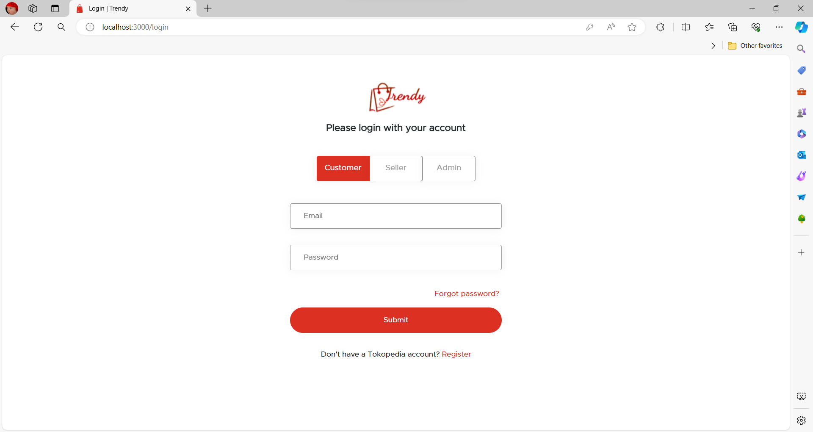
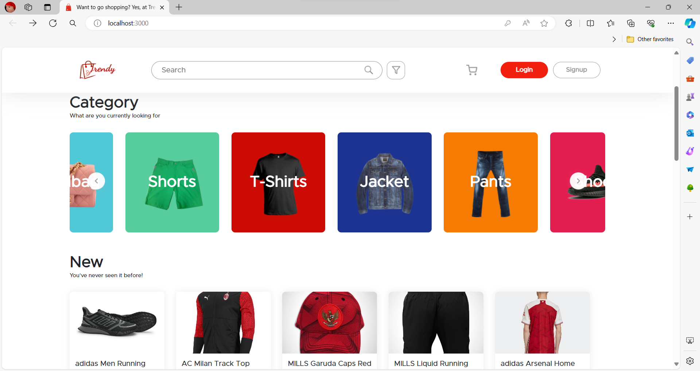
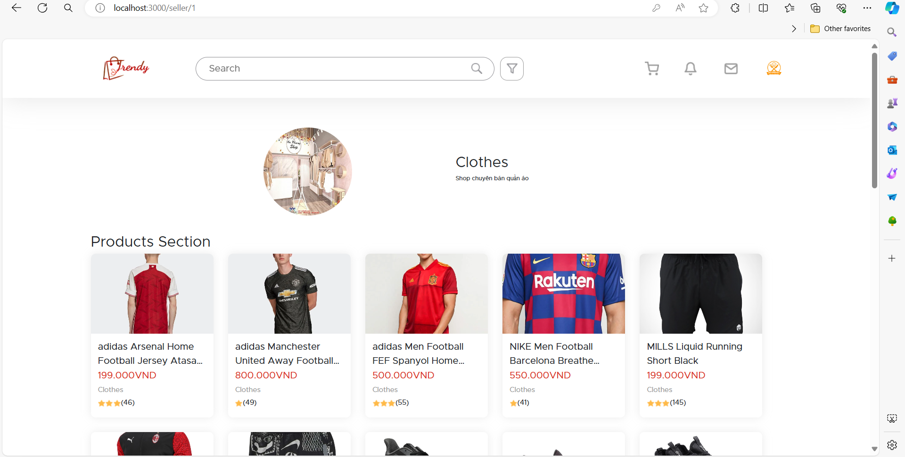
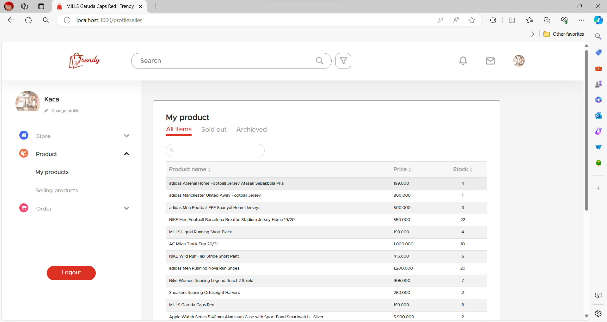

# Trendy Web 

<div align="center">
    
</div>

## Contents

- [Description](#description)
- [Features](#features)
- [Requirements](#requirements-for-development)
- [Installation](#installation-for-development)
- [Screenshoots](#screenshoots)

## Description

**Trendy Web** is a B2C e-commerce web application that allows customers to view and order clothes. At the same time, it allows sellers to post products for sale. Admin has the role of viewing and managing users.
## Features

- Order product
- History transaction
- Add product (sellers only)
- Edit profile
- Reset Password
- etc

## Requirements for Development

- [`Node Js`](https://nodejs.org/en/)
- [`npm`](https://www.npmjs.com/get-npm)
- [`ReactJs`](https://reactjs.org/)

## Installation for Development

1. Open your terminal or command prompt
2. Git clone
3. Open the folder and type `npm install` for install dependencies

```bash
REACT_APP_API_URL = "http://localhost:8000"
REACT_APP_SOCKET_URL = "http://localhost:8001"
REACT_APP_WEB_URL = "http://localhost:3000"
REACT_APP_URL="http://localhost:3000"
```
5. Create file **_.env_** in backend directory with the following contents :

- cd /backend:

```bash
HOST = "localhost"
DBUSER = "root"
DATABASE = "trendy"
PASSWORD = ""
PORT = 8000
SOCKET_PORT = 8001
SECRET_KEY = "admin1234"
REACT_APP_API_URL = "http://localhost:8000"
REACT_APP_SOCKET_URL = "http://localhost:8001"
REACT_APP_WEB_URL = "http://localhost:3000"
REACT_APP_URL="http://localhost:3000"
```
6. Before run this, you must installation backend and then run backend
7. Type `npm start` in terminal for running this project.
8. If you want to build, type `npm run build`.

## Screenshoots

<div align="center">
    
    
    
    
</div>
